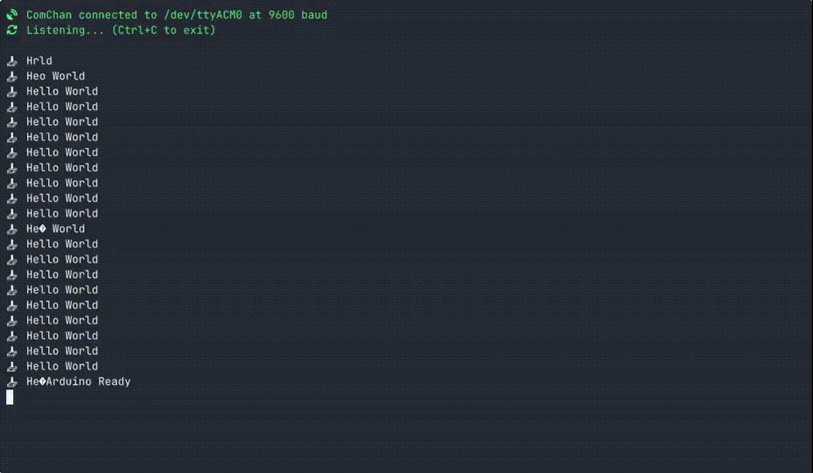

# ComChan (Communication Channel)


<div align="center">

**A Blazingly Fast Serial Monitor for Embedded Systems and Serial
Communication**

[Features](#features) • [Installation](#installation) •
[Documentation](https://vaishnav.world/ComChan) • [Examples](#examples) •

</div>

---

<!-- START doctoc generated TOC please keep comment here to allow auto update -->
<!-- DON'T EDIT THIS SECTION, INSTEAD RE-RUN doctoc TO UPDATE -->
**Table of Contents**

- [Installation](#installation)
  - [From crates.io](#from-cratesio)
  - [From AUR](#from-aur)
  - [Using Homebrew](#using-homebrew)
  - [From source](#from-source)
- [Documentation](#documentation)
- [Common Commands](#common-commands)
  - [Basic Serial Monitor](#basic-serial-monitor)
  - [Verbose Mode](#verbose-mode)
  - [Log Mode](#log-mode)
  - [Serial Plotter](#serial-plotter)
  - [Automatically Detect Serial Ports](#automatically-detect-serial-ports)
  - [Use a Configuration File](#use-a-configuration-file)
- [Features](#features)
  - [Current Features ✅](#current-features-)
  - [Planned Features 🚧](#planned-features-)
  - [Legends](#legends)
- [Examples](#examples)
  - ["Hello World" Program](#hello-world-program)
  - [User Input](#user-input)
  - [Serial Plotter](#serial-plotter-1)
  - [Auto Serial Port Detector](#auto-serial-port-detector)
  - [Using the Configuration File](#using-the-configuration-file)
    - [Serial Monitor (`plot = false`)](#serial-monitor-plot--false)
    - [Serial Plotter (`plot = true`)](#serial-plotter-plot--true)
    - [Serial Plotter Multiple Sensor Values](#serial-plotter-multiple-sensor-values)
  - [Full Working Demo](#full-working-demo)
  - [ComChan in Windows](#comchan-in-windows)
- [Community](#community)
  - [Stargazers over time (Graph)](#stargazers-over-time-graph)
- [🧠 (mostly) Brain made](#-mostly-brain-made)

<!-- END doctoc generated TOC please keep comment here to allow auto update -->

---

## Installation

Choose your preferred installation method:

### From crates.io

> [!NOTE]
> The easiest way to install ComChan is via `cargo install`

```bash
# Install from source
cargo install comchan

# Install the binary directly (faster)
cargo binstall comchan
```

Verify the installation:

```bash
comchan --version
```

### From AUR

For Arch Linux users, ComChan is available in the AUR (thanks to
[orhun](https://github.com/orhun)!):

```bash
# Using yay
yay -S comchan

# Using paru
paru -S comchan
```

### Using Homebrew

ComChan can be installed via Homebrew taps:

```bash
brew install Vaishnav-Sabari-Girish/taps/comchan
```

### From source

Build from source for the latest development version:

```bash
# Clone from GitHub
git clone git@github.com:Vaishnav-Sabari-Girish/ComChan.git

# Or clone from Codeberg
git clone ssh://git@codeberg.org/Vaishnav-Sabari-Girish/ComChan.git

# Build and run
cd ComChan
cargo build --release
cargo run
```

---

## Documentation

📚 The full documentation for ComChan can be found at
**[vaishnav.world/ComChan](https://vaishnav.world/ComChan)**

---

## Common Commands

### Basic Serial Monitor

Monitor serial output from your device:

```bash
comchan -p <port> -r <baud_rate>
# OR
comchan --port <port> --baud <baud_rate>
```

**Example:**

```bash
comchan -p /dev/ttyUSB0 -r 9600
```

### Verbose Mode

Get detailed information about the serial connection:

```bash
comchan -p <port> -r <baud_rate> -v
# OR
comchan --port <port> --baud <baud_rate> --verbose
```

### Log Mode

Save serial output to a log file:

```bash
comchan -p <port> -r <baud_rate> -l <log_file_name>
# OR
comchan --port <port> --baud <baud_rate> --log <log_file_name>
```

📄 [View example log file](./test.log)

### Serial Plotter

Visualize sensor data in real-time:

```bash
comchan --port <port> --baud <baud_rate> --plot
# OR
comchan -p <port> -r <baud_rate> --plot
```

### Automatically Detect Serial Ports

Let ComChan find your serial device automatically:

```bash
# With default baud rate (9600)
comchan --auto

# With custom baud rate
comchan --auto --baud <baud_rate>
# OR
comchan --auto -r <baud_rate>
```

**Example:**

```bash
comchan --auto --baud 115200
```

### Use a Configuration File

Starting from version 0.1.9, you can use a configuration file instead of
command-line flags:

```bash
# Generate default configuration file
comchan --generate-config
```

This creates a config file at `~/.config/comchan/comchan.toml`

**Example Configuration:**

```toml
# ComChan Configuration File
#
# This file contains default settings for comchan serial monitor.
# Command line arguments will override these settings.
#
# To use auto-detection, set port = "auto"
# Available parity options: "none", "odd", "even"
# Available flow control options: "none", "software", "hardware"

port = "auto"
baud = 9600
data_bits = 8
stop_bits = 1
parity = "none"
flow_control = "none"
timeout_ms = 500
reset_delay_ms = 1000
verbose = false
plot = false
plot_points = 100
```

> [!NOTE]
> The default baud rate is `9600`. You can customize it in the config file or
> override it with command-line flags (`--auto`, `--port`/`-p`, `--baud`/`-r`,
> `--plot`).

---

## Features

### Current Features ✅

- **Read Serial Data** - Monitor incoming serial data from any serial port
- **Write to Serial Port** - Send data to your serial device
- **Basic Logging** - Save serial output to log files
- **Auto-Detect Serial Ports** - Automatically find connected serial devices
- **Configuration Files** - Use `.toml` files instead of command-line flags
- **Terminal-Based Serial Plotter** - Visualize data in real-time with the
  `--plot` flag
- **Multiple Sensor Plotting** - Plot multiple sensor values simultaneously with
  legends

### Planned Features 🚧

- **Export Serial Data** - Write serial data to files (`.txt`, `.csv`, and more)

### Legends

- ✅ Implemented Features
- 🚧 Yet to be implemented

---

## Examples

### "Hello World" Program

Basic serial monitoring in action:


📝
[View Arduino code](./code_tests/test_comchan_arduino_uno/test_comchan_arduino_uno.ino)

---

### User Input

Interactive serial communication:


📝 [View Arduino code](./code_tests/test_user_input/test_user_input.ino)

---

### Serial Plotter

Real-time data visualization:


📝 [View Arduino code](./code_tests/random_sensor_vals/random_sensor_vals.ino)

---

### Auto Serial Port Detector

Automatic port detection in action:


---

### Using the Configuration File

#### Serial Monitor (`plot = false`)


#### Serial Plotter (`plot = true`)


#### Serial Plotter Multiple Sensor Values

Plot multiple sensors simultaneously with automatic legends:


📝
[View Arduino code](./code_tests/random_sensor_vals_multiple/random_sensor_vals_multiple.ino)

---

### Full Working Demo

Complete workflow demonstration:



---

### ComChan in Windows

As of Version 0.2.2, ComChan works perfectly on Windows with no limitations!

[](https://www.youtube.com/watch?v=23sSd4_bcxM)

**Windows Installation:**

1. Download the `.exe` file from the
   [releases page](https://github.com/Vaishnav-Sabari-Girish/ComChan/releases)
2. Open Command Prompt or PowerShell
3. Navigate to the download location:

   ```powershell
   cd Downloads
   ```

4. Run ComChan:

   ```powershell
   comchan.exe --help
   ```

## Community

### Stargazers over time (Graph)

[](https://starchart.cc/Vaishnav-Sabari-Girish/ComChan)

## 🧠 (mostly) Brain made

**This project was NOT vibe-coded BUT AI is still involved in some parts of
it.**

- **Generating test code:** Because it's something I always skip so I would
  rather have some AI generated tests than none at all.
- **Micro-improvements:** I have used AI as an advisor to improve some bits of
  code here and there. Big refactors or new features are done by my hand though.

<a href="https://brainmade.org/">
<picture>
  <source media="(prefers-color-scheme: dark)" srcset="https://brainmade.org/white-logo.svg">
  <source media="(prefers-color-scheme: light)" srcset="https://brainmade.org/black-logo.svg">
  
</picture>
</a>

<div align="center">

Made with ❤️ by the ComChan Community

[⬆ Back to Top](#comchan-communication-channel)

</div>
